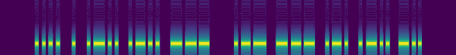
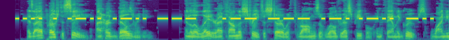
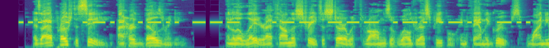
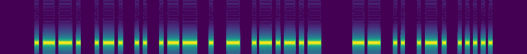

# Morse Code Toolkit
This is a toolkit for training end-to-end NeMo-based CTC models for 
morse code recognition, as well as generating morse code audio corpora.

Key features:

* Generate morse audio  
  * Quickly generate large corpora from text files
  * Mix in background noise from existing audio
  * Use arbitrary alphabets in any language, built-in or user-supplied
* Train DNNs for end-to-end morse code recognition
  * Recipes for NeMo-based CTC ASR models
  * Pre-trained English and Russian models
* Evaluate morse recognition models
  * Using synthetic or labeled data sets
* Based on NeMo 
  * Rapid experimentation
  * Large library of existing components to exploit

# Installation
This is a Python package which is installed via `pip`.

The most demanding requirement will be [NeMo](https://github.com/NVIDIA/NeMo),
and it may be beneficial to install NeMo separately via the instructions in
their repo if there are issues.

To install with `pip`:

```console
$ git clone https://github.com/1-800-BAD-CODE/morsecodetoolkit
$ cd morsecodetoolkit
$ pip setup.py develop
```

## Installation Check
We can get our feet wet by decoding an example morse file from
Wikipedia with a pre-trained model included with this toolkit:

```text
# Download a morse audio file from wikipedia
$ wget https://upload.wikimedia.org/wikipedia/commons/0/04/Wikipedia-Morse.ogg

# Decode the audio with a pre-trained model from this repo
$ mct-morse-to-text pretrained/english/quartznet10x5.nemo Wikipedia-Morse.ogg
    ...
    ...
  INFO : Transcription: 'WELCOME TO WIKIPEDIA, THE FREE ENCYCLOPEDIA THAT ANYONE CAN EDIT.'
```

And this is indeed the correct transcription, punctuation and all.

# Training a Morse Recognition Model
The out-of-the-box capabilities of this toolkit provides for training
a NeMo-based model with CTC loss to recognize morse audio in an 
end-to-end fashion for various languages.

For training a morse recognition model, see
[./examples/morse-to-text/](./examples/morse_to_text/).


# Pre-trained Models
Two pre-trained models are included in [./pretrained/](./pretrained/):

1. English: 10x5 QuartzNet 
2. Russian: 10x5 QuartzNet

Both of these models are end-to-end morse audio recognition models
that accept as input audio signals and produce as output a matrix
of probabilities. The input should be morse code audio, and the output
represents the likelihood of a character sequence (the contents of the 
encoded morse signal).

These models work with this toolkit's decoding scripts and can be 
retrained with the included recipes. The decoding scripts will abstract
the decoding logic, though there is little to abstract given that they are 
end-to-end models.

Training time for these models with a synthetic dataset is a 
few hours on a single device for acceptable results (~1% WER 
with the chosen data generation parameters). The Russian model was
fine-tuned from the English model, which was trained from scratch.


# Generating Morse Audio
This toolkit provides utilities for generating morse audio from text,
including the ability to mix in background noise.

## Generating a Large Corpus
To generate a large corpus (more than a single file), see the example in
[./examples/synthesize_dataset/](./examples/synthesize_dataset/). This
example utilizes the same methodology described in the next section, 
but does so on a large scale with convenient abstractions.

## Generating a Single Morse Audio
To generate a single morse audio, there is a tool exposed on the 
command line for converting text to a morse audio file. This tool is
intended for demonstration purposes, as it only produces one file at
a time.

In its simplest usage, the executable `mct-text-to-morse` accepts
text and an output path to generate a morse signal:

```console
$ mct-text-to-morse \
    "HELLO WORLD" \
    morse_hello.wav 
```

Let's observe the Mel spectrogram of the generated audio file 
`morse_hello.wav` with `scripts/extract_spectrogram.py`:



Here we see the letter H (`dit dit dit dit`), followed by a short 
character break (3 dit duration), followed by an E (`dit`),
and so on. Note the longer break in the center is a word break 
(7 dit duration) between HELLO and WORLD.

We see that the spectrogram is un-naturally quiet and it's quite easy
to recognize the content. Thus, the tool also allows us to specify
some audio to use as background noise. Furthermore, we can change many
parameters of how the morse signal is generated, as well. This verbose 
example configures many of those options:

```console
$ mct-text-to-morse \
    "HELLO WORLD" \
    morse_hello_noisy.wav \
    --alphabet-name international \
    --background-audio <librispeech>/dev-other/116/288045/116-288045-0000.flac \
    --sample-rate 16000 \
    --tone-freq 2000 \
    --snr-db 15 \
    --gain-db -15 \
    --pad-left 300 \
    --pad-right 300 \
    --rng-seed 1234 \
    --dit-duration 75 \
    --duration-sigma 5
```



It's now certainly more interesting for a machine learning problem.

To see brief documentation of these arguments (and even more
options), specify the `--help` argument:

```console
$ mct-text-to-morse --help
```

# Decoding Morse Audio Files
This toolkit provides utilities for decoding morse audio files given
a trained morse recognition model. These utilities are compatible with
any model which is a subclass of `nemo.collections.asr.models.ASRModel`.

## Decoding a Corpus
To decode a corpus of morse audio files (more than a single file), see
[./examples/morse_to_text/infer.py](./examples/morse_to_text/infer.py).

To decode a corpus of morse audio files and compute the WER of a trained
morse recognition model, see 
[./examples/morse_to_text/evaluate.py](./examples/morse_to_text/evaluate.py).

## Decoding a Single Morse Audio File
This toolkit provides a simple command-line tool to decode a single
audio file which contains morse:

```console
$ mct-morse-to-text --help
  usage: mct-morse-to-text [-h] model audio_file
  
  Simple tool to transcribe a single morse audio file. For large-scale decoding and evaluation, see `examples/morse_to_text/`.
  
  positional arguments:
    model       Path to a .nemo model. Model should be a subclass of NeMo's ASRModel.
    audio_file  Path to an audio file.
  
  optional arguments:
    -h, --help  show this help message and exit
```

E.g. we can decode the two "HELLO WORLD" files we generated in the
previous section and check if the pre-trained English model can
correctly decode them:

```console
$ mct-morse-to-text \
    pretrained/english/quartznet5x3.nemo \
    morse_hello.wav
    
    ...
    [17:58:25] INFO : Transcription: 'HELLO WORLD'
```

And the noisier file:

```console
$ mct-morse-to-text \
    pretrained/english/quartznet5x3.nemo \
    morse_hello_noisy.wav
    
    ...
    [17:59:19] INFO : Transcription: 'HELLO WORLD'
```

And if we make it really noisy, we might expect mistakes.
Let's recreate the HELLO WORLD audio with an SNR of -5. This model 
was trained with a minimum of 10, hence to the model it should look 
unrecognizably noisy:

```console
$ mct-text-to-morse \
  "HELLO WORLD" \
  morse_hello_noisier.wav \
  --background-audio <librispeech>/dev-other/116/288045/116-288045-0000.flac \
  --sample-rate 16000 \
  --tone-freq 2000 \
  --snr-db -5 \
  --gain-db -15 \
  --pad-left 300 \
  --pad-right 300 
  --rng-seed 1234 \
  --dit-duration 75 \
  --duration-sigma 5
```

And let's decode this noisier file in the same way:

```console  
$ mct-morse-to-text \
    pretrained/english/quartznet5x3.nemo \
    morse_hello_noisier.wav
    
    ...
    [18:00:52] INFO : Transcription: 'HELLO WORLS'
```

And at this SNR level, a decoding error is seen.

Let's visualize the model's error:



When the model should have observed a final `dash dit dit` 
sequence ('D'), it predicted a `dit dit dit` sequence ('S')
through the noise.


# Alphabets
Arbitrary languages can be used by supplying an alphabet: a mapping of
characters to their morse sequence of dits and dashes. This project
includes English and Russian alphabets. 

For more information on alphabets and encodings, see 
[./docs/alphabets_and_encodings.md](./docs/alphabets_and_encodings.md)

E.g., we can repeat the above demonstration with Russian, which is the
other language for which there is currently a pre-trained model and
built-in alphabet:

```text
# Encode Russian 'Hello, world.' 
$ mct-text-to-morse \
    "Привет, мир." \
    hello_world_ru.wav \
    --alphabet-name russian
```

And let's inspect the spectrogram of this generated morse audio file:

```text
$ python scripts/extract_spectrogram.py \
    hello_world_ru.wav \
    images/morse_hello_ru.png
```



We can take a look at the definition of the 
[Russian alphabet](./morsecodetoolkit/alphabet/data/russian.yaml)
and verify the first two letters, `ПР`:

```yaml
letters:
  # ...
  - key: "П"
    code: ["DIT", "DASH", "DASH", "DIT"]
  - key: "Р"
    code: ["DIT", "DASH", "DIT"]
  # ...
```

And finally decode it with the pre-trained Russian model:

```text
$ mct-morse-to-text \
    pretrained/russian/quartznet10x5.nemo \
    hello_world_ru.wav
  ...
  INFO : Transcription: 'ПРИВЕТ, МИР.'
```