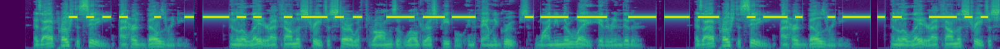
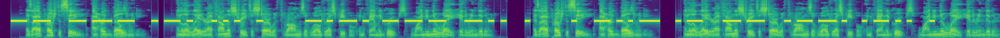

# Dataset Synthesis
This is an example of how to generate an arbitrarily-large morse
dataset from text.

There are three general steps to accomplish this:

1. Prepare some text data to synthesize
2. Prepare an audio data set to use as background noise
3. Use the `synthesize.py` script to generate a synthetic dataset
and save it to disk

# Data Prep
In this section we prepare the input files for generating a synthetic
morse audio corpus.

## Prepare Text Data
We generate morse signals from text files containing one sentence
per line.

The definition of a sentence in this context is arbitrary, but keep 
in mind that each sentence will generate one morse signal and morse 
audio signals are significantly longer than speech. 12 or fewer words 
is a good target length.

Datasets with very long sentences are OK, because we can tell the 
data loader to truncate sentences, anyway. This strategy works well 
for CTC model training where long audio files might cause
out-of-memory issues.

We'll use this text file for this example:

```console
$ cat sample.txt 
  hello world
  morse code example
```


## Prepare Background Audio
Background audio prevents generating clean morse signals,
which would be both unrealistic and easy to decode. The synthetic 
dataset that we will create can accept a manifest of audio files to
mix in as background noise. 

Any number of audio files can be specified in the manifest and they 
will be randomly selected when the dataset generates examples.

We will use this manifest with a couple LibriSpeech files in it:

```console
$ cat sample_background.json 
  {"audio_filepath":  "/path/to/dev-other/116/288045/116-288045-0000.flac"}
  {"audio_filepath":  "/path/to/dev-other/116/288045/116-288045-0001.flac"}
```


# Run Synthesis
Now we use the text file and audio manifest created in the previous 
section to instantiate a synthetic morse dataset and save it to disk. 
We accomplish this with the simple script `synthesize.py`, which in 
two lines of code creates a dataset and then tells that dataset to 
synthesize and save to disk.

`synthesize.py` has a `main` function decorated with NeMo's 
`hydra_runner`, which by default points to the 
configuration `conf/english.yaml`. This configuration file contains
almost all of the parameters we need; we just need to specify the
local files we just created and an output directory:

```console
$ python synthesize.py \
    output_dir=./test_corpus/ \
    text_file=sample.txt \
    audio_manifest=sample_background.json
```


# Examine the Corpus
Let's check the output directory:

```console
$ tree test_corpus/
  test_corpus/
  ├── manifest.json
  └── wav
      ├── audio_0.wav
      └── audio_1.wav
```

We now have two audio files, one for each text input we created. 
We also have a manifest:

```console
$ cat test_corpus/manifest.json 
  {"audio_filepath": "/path/to/test_corpus/wav/audio_0.wav", "text": "HELLO WORLD", "duration": 12.719}
  {"audio_filepath": "/path/to/test_corpus/wav/audio_1.wav", "text": "MORSE CODE EXAMPLE", "duration": 20.007}
```

If you're familiar with NeMo speech recognition, this manifest format may 
look familiar. That's because a morse audio corpus is exactly a speech 
recognition corpus, except the audio signals are encoded with morse tones
rather than speech.

The manifest contains audio file paths to each file created, along
with the audio file contents and file length. Note the upper-case text. This
is because morse does not use cased text, and we default to always using
upper-case text for simple uniformity throughout this toolkit.

Let's take a look at what's actually in the audio files. We can examine the
spectrogram of a file with an included script:

```console
$ python ../../scripts/extract_spectrogram.py \
    test_corpus/wav/audio_0.wav \ 
    images/audio_0.png
$ xdg-open images/audio_0.png
```

And we should see the following spectrogram:



Note the bright rectangular regions lining much of the mid frequencies
(this is a Mel-spaced spectrogram).
These are the dits and dashes, overlaid on some speech. According to 
the manifest, this file contains "HELLO WORLD". We can see the `HE` 
at the beginning, which is represented by the first two sequences
of 4 dits (short tones) for the `H` and 1 dit for the `E`. 
Note after that we see a pair of `dit dash dit dit` sequences, which 
are the next two letters: `LL`.

Note that in the configuration file we did not specify the exact
frequency at which these tones appeared. Rather, we specifed a minimum
and a maximum and the dataset randomly chose. In fact, almost all 
parameters are chosen randomly between some values. Sometimes these
parameters are even chosen with a second layer of randomness, e.g.,
each dit and dash duration is drawn from a Gaussian distribution around 
a mean chosen once per example (though that level of detail may be 
hard to see here).

Let's see the synthesized diversity by looking at the second audio 
file which was generated by the same process:



This second file has a lower frequency, starts earlier in 
the audio file, and has a lower SNR (ratio of morse/background noise).

This randomness is helpful in generating a robust morse recognition
model in other examples.

# Automatic Morse Recognition
We can use a pretrained model to decode the audio files we just 
generated. We can do this with a simple utility included 
in the toolkit and exposed on the command line. This tool is meant for
simple, single-file decoding, ostensibly for demonstration purposes. 
Let's decode the files whose spectrograms we just examined:

```console 
$ mct-morse-to-text \
    ../../pretrained/english/quartznet10x5.nemo \
    test_corpus/wav/audio_0.wav
 ...
 INFO : Transcription: 'HELLO WORLD'
   
  
$ mct-morse-to-text \
    ../../pretrained/english/quartznet10x5.nemo \
    test_corpus/wav/audio_1.wav
 ... 
 INFO : Transcription: 'MORSE CODE EXAMPLE'
```

In this case, the pretrained model had no problem determining what 
message was encoded in the audio files. When decoding morse signals
generated with the default parameters, the pretrained model's WER
should be less than 1%.


# Corpus Evaluation or Model Training
To evaluate a corpus of many labeled morse signals (not just one, as
in the previous section) or train models, see 
[examples/morse_to_text/](../morse_to_text/).